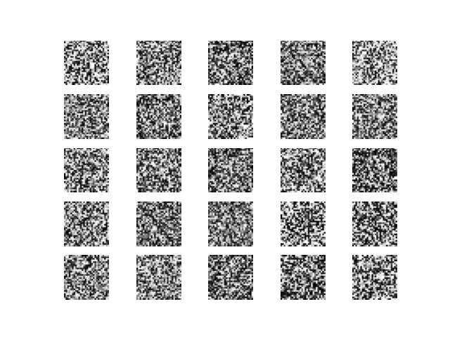
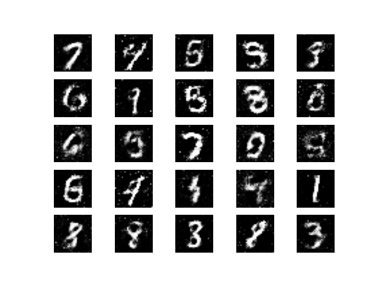
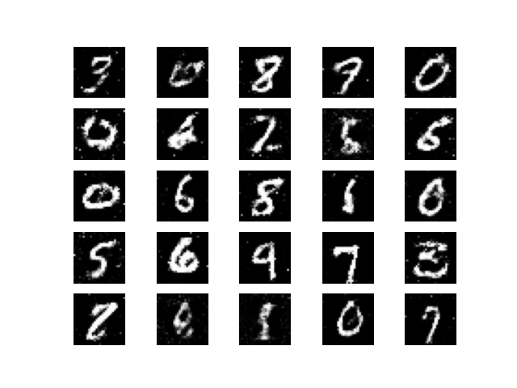

# 🎨 Gen AI Handwritten Digit Generator Using MNIST GAN

[](https://www.python.org/downloads/)
[](https://tensorflow.org/)
[](https://keras.io/)
[](LICENSE)
[](https://jupyter.org/)

A comprehensive implementation of **Generative Adversarial Networks (GANs)** for generating handwritten digits using the MNIST dataset. This project demonstrates the power of adversarial training where two neural networks compete to create realistic digit images.

<table>
  <tr>
    <td align="center">
      <br>
      <em>Figure 1: Outputs of the early stages (Epoch 0)</em>
    </td>
    <td align="center">
      <br>
      <em>Figure 2: Outputs of the intermediate stages (Epoch 5000)</em>
    </td>
      <td align="center">
      <br>
      <em>Figure 2: Outputs of the final stages (Epoch 9900)</em>
    </td>
  </tr>
</table>


## 🚀 Project Overview

This repository contains a complete GAN implementation that learns to generate new handwritten digits visually similar to the MNIST training dataset. The model consists of two competing neural networks:

- **🏗️ Generator Network**: Creates fake digit images from random noise vectors
- **🕵️ Discriminator Network**: Distinguishes between real MNIST images and generated fakes
- **⚔️ Adversarial Training**: Both networks improve through competitive learning

## 🎯 Key Features

- ✅ **Progressive Training**: 10,000 epochs with batch processing
- ✅ **Automatic Output Management**: Generated images saved in organized folders
- ✅ **Real-time Monitoring**: Loss tracking and accuracy metrics
- ✅ **Apple Silicon Optimized**: Compatible with M1/M2/M3 Macs
- ✅ **Professional Documentation**: Comprehensive code comments and explanations

## 📁 Project Structure

```
Gen_AI_Model/
├── README.md                    # Project documentation
├── Gen_AI_Model.ipynb          # Main implementation notebook
├── environment.yml             # Conda environment configuration
├── Output/                     # Generated images during training
│   ├── gan_images_0.png
│   ├── gan_images_100.png
│   └── ...
└── assets/                     # Sample results and visualizations
    ├── early.png
    ├── intermediate.png
    └── final.png
```

## 🛠️ Installation & Setup

### Prerequisites
- Python 3.10+
- Conda package manager
- Jupyter Lab/Notebook

### 1. Clone the Repository
```bash
git clone https://github.com/yourusername/Gen_AI_Model.git
cd Gen_AI_Model
```

### 2. Create Conda Environment
```bash
# Create environment from yml file
conda env create -f environment.yml

# Activate environment
conda activate genai-gan
```

### 3. Register Jupyter Kernel
```bash
python -m ipykernel install --user --name genai-gan --display-name "Python (genai-gan)"
```

### 4. Launch Jupyter
```bash
jupyter lab
# or
jupyter notebook
```

### 5. Select Kernel
In Jupyter, select **"Python (genai-gan)"** kernel for the notebook.

## 🚀 Usage

1. **Open the notebook**: `Gen_AI_Model.ipynb`
2. **Select the correct kernel**: "Python (genai-gan)"
3. **Run all cells** or execute step by step:
   - Import libraries and load MNIST dataset
   - Build Generator network architecture
   - Build Discriminator network architecture  
   - Train the GAN model (10,000 epochs)
4. **Monitor progress**: Generated images saved every 100 epochs in `Output/` folder
5. **View results**: Check the progression of generated digits over training

## 🏗️ Model Architecture

### Generator Network
- **Input**: 100-dimensional random noise vector
- **Hidden Layers**: 
  - Dense(256) → LeakyReLU → BatchNormalization
  - Dense(512) → LeakyReLU → BatchNormalization  
  - Dense(1024) → LeakyReLU → BatchNormalization
- **Output**: Dense(784) → Tanh → Reshape(28, 28, 1)

### Discriminator Network
- **Input**: 28×28×1 grayscale images (flattened to 784)
- **Hidden Layers**:
  - Flatten → Dense(512) → LeakyReLU
  - Dense(256) → LeakyReLU
- **Output**: Dense(1) → Sigmoid (0=fake, 1=real)

## 📊 Training Process

The GAN training follows a minimax game approach:

1. **Discriminator Training**:
   - Train on real MNIST images (label = 1)
   - Train on generator's fake images (label = 0)
   - Goal: Better distinguish real vs fake

2. **Generator Training**:
   - Generate fake images from noise
   - Train to fool discriminator (fake labeled as real)
   - Goal: Create more realistic images

## 🎨 Results

The model progressively generates better quality digits:

- **Early stages (0-1000 epochs)**: Noisy, unclear shapes
- **Intermediate (1000-5000 epochs)**: Recognizable digit structures
- **Final stages (5000+ epochs)**: High-quality, realistic handwritten digits

Generated samples are automatically saved in the `Output/` directory every 100 epochs.


## 🐛 Troubleshooting

### Kernel Crashes
- Ensure you're using the correct conda environment
- Verify TensorFlow installation: `python -c "import tensorflow as tf; print(tf.__version__)"`

### Apple Silicon Issues
- The environment is optimized for M1/M2/M3 Macs
- TensorFlow automatically uses Metal acceleration when available

### Memory Issues
- Reduce batch size if encountering OOM errors
- Consider training for fewer epochs initially

## 🤝 Contributing

1. Fork the repository
2. Create a feature branch (`git checkout -b feature/amazing-feature`)
3. Commit your changes (`git commit -m 'Add amazing feature'`)
4. Push to the branch (`git push origin feature/amazing-feature`)
5. Open a Pull Request


